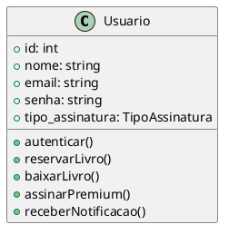

# Template de Descrição de Classe

## Nome da Classe

- **Descrição:**
    - Breve descrição do propósito da classe e seu papel no sistema.

- **Atributos:**
    - atributo1: tipo — descrição
    - atributo2: tipo — descrição
    - ...

- **Métodos:**
    - metodo1(parâmetros): tipo de retorno — descrição
    - metodo2(parâmetros): tipo de retorno — descrição
    - ...

- **Relacionamentos:**
    - Associação, agregação, composição ou herança com outras classes (listar e descrever).

- **Regras de Negócio Relacionadas:**
    - Listar regras de negócio do documento de casos de uso que impactam esta classe.

- **Casos de Uso Relacionados:**
    - Listar os casos de uso do documento que envolvem esta classe.

- **Observações:**
    - Pontos importantes, restrições ou detalhes adicionais.

---

Adicionar o diagrama de classes.

